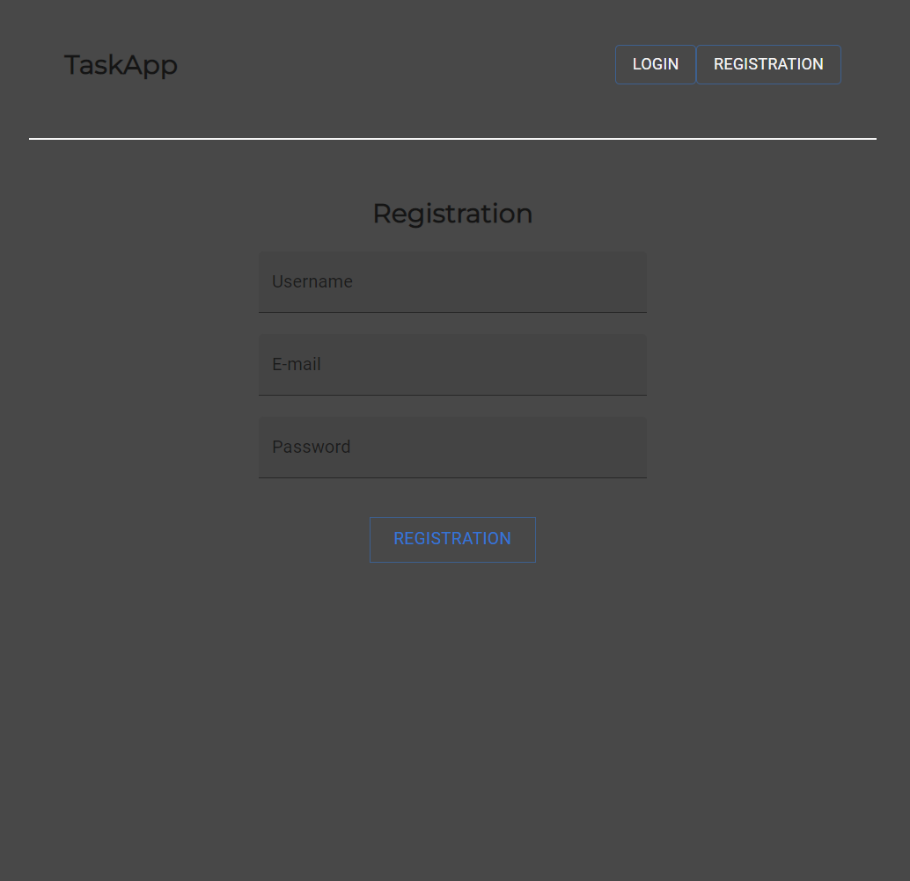
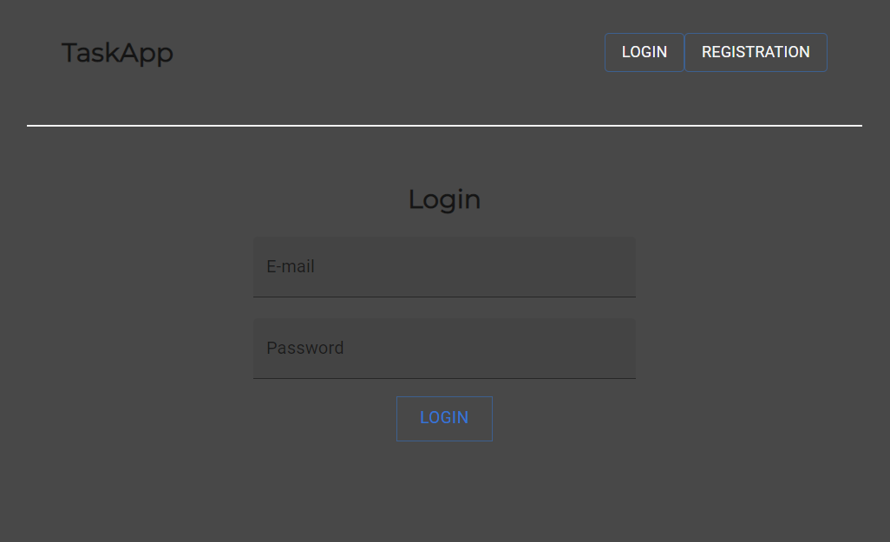
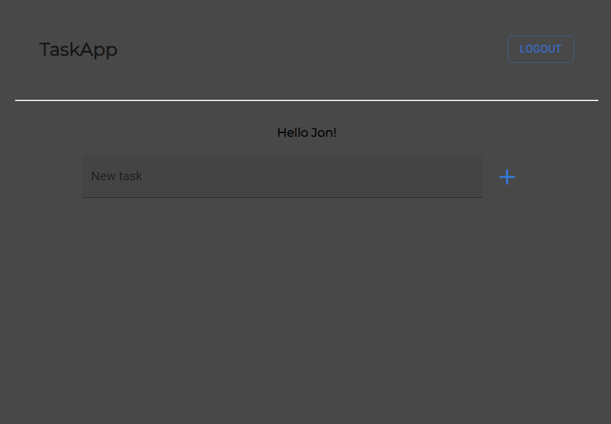

# TaskApp project for portfolio 

### Link to the page:
#### https://portfolio-taskit-app.netlify.app/

### Example `e-mail` and `password`:
#### `email`: joanna@g.com
#### `password`: joanna

### Description:
This page was done for my portfolio. Built with:
#### Backend:
- Node.js
- express
- cors
- mongoose
- bcrypt
- jsonwebtoken
#### Frontend:
- react
- redux
- Material UI
- axios
- moment
- react-notification-component
- jwt-decode
- axios

Preview:
### 
### 
### 
### 

### How to clone and run a project on Your computer

Clone down this repository. You will need `node` and `npm` installed globally on your machine.

Clone:

`git clone https://github.com/UntypicalSeba/<name-of-project-on-github>`

Installation:

`npm install`

To Start Server:

1. Configure Your database and `.env` file in backend folder.
2. In terminal go to folder ./backend/ and then 
`npm index.js` or use script from package.json file.

To Start React App:

1. In terminal go to folder ./backend/ and then 
`npm run dev`

To Visit App:

Link to the site will be shown in Your terminal

### My links:

* **LinkedIn:** www.linkedin.com/in/sebastian-michalowicz
